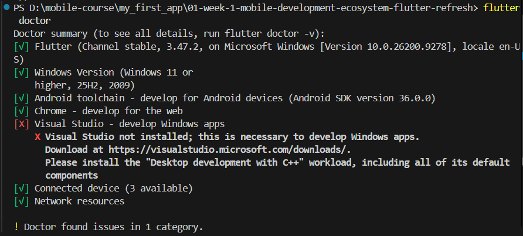
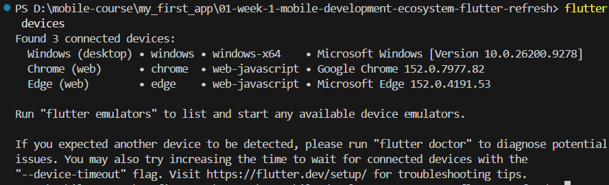

1. flutter doctor checklist verification

2. flutter devices checklist verification

3. 
4. the difference between hot reload and hot restart is hot reload load the new code to the virtual machine and rerun build function from widget that changed, if hot restart is restart the whole application and delete the running app

Reflective
1. Native development is more appropriate when an app requires high performance, platform-specific features, or deep integration with the operating system.
2. State changes update the widget tree, causing Flutter to rebuild the affected widgets and update the UI declaratively based on the new state.
3. Small commits with clear messages make changes easier to track, review, and collaborate on, while also showing good development practices in a portfolio.

