4. PRAKTIKUM: Layout Sederhana (warm-up)
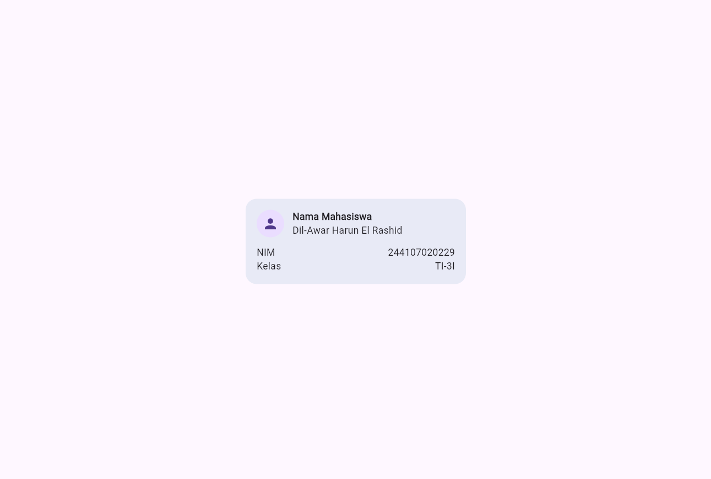
Experiment Warm-Up
1. 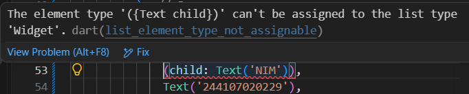
2. 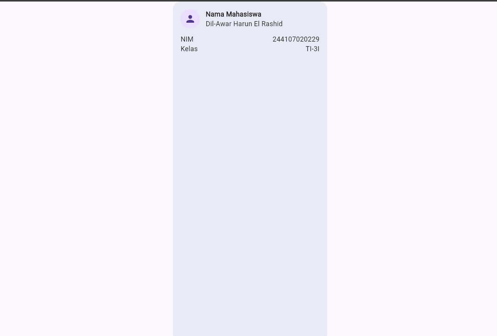
3. 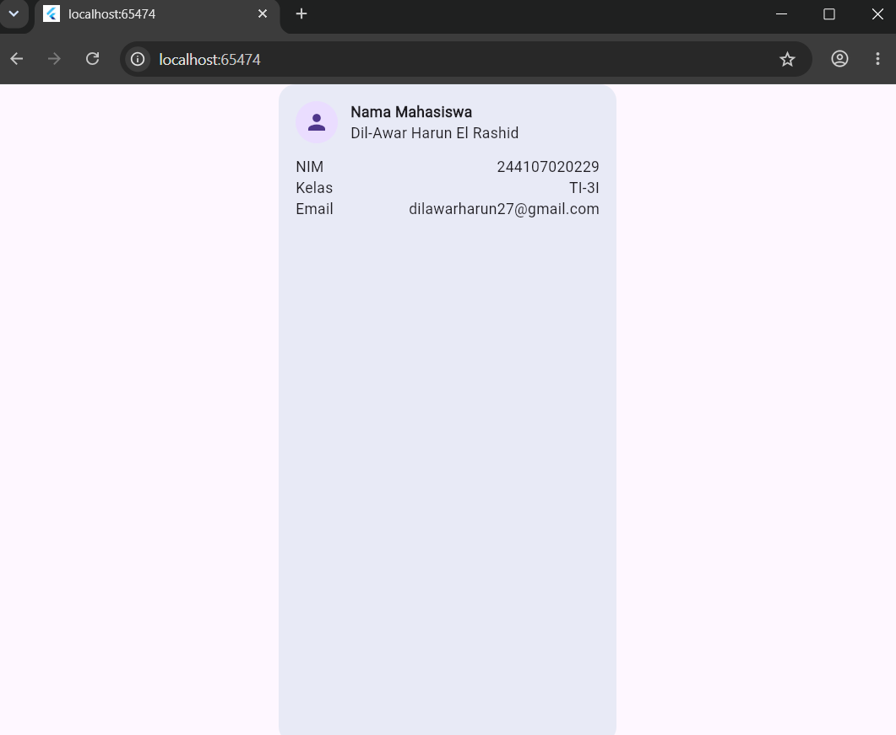

5. PRAKTIKUM: Dashboard Responsif
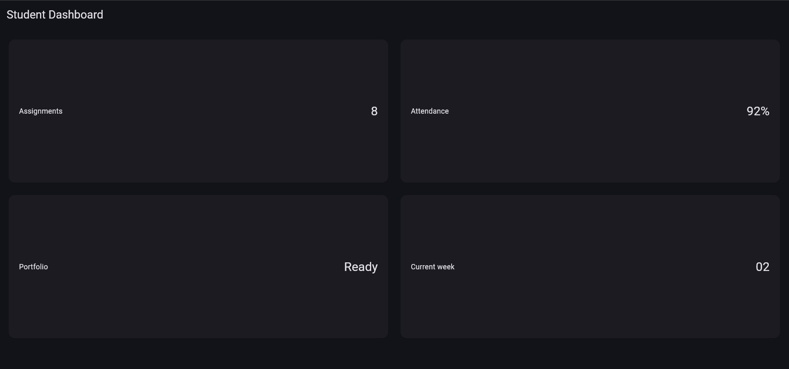
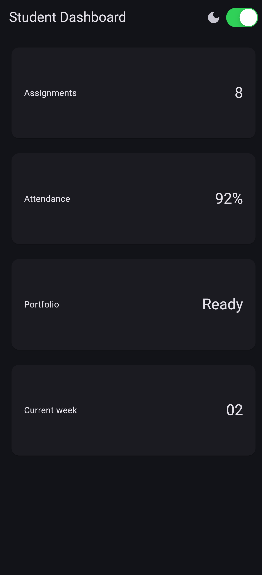
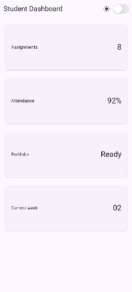
Experiment Layout
1. When i change it to 300 it will look like this
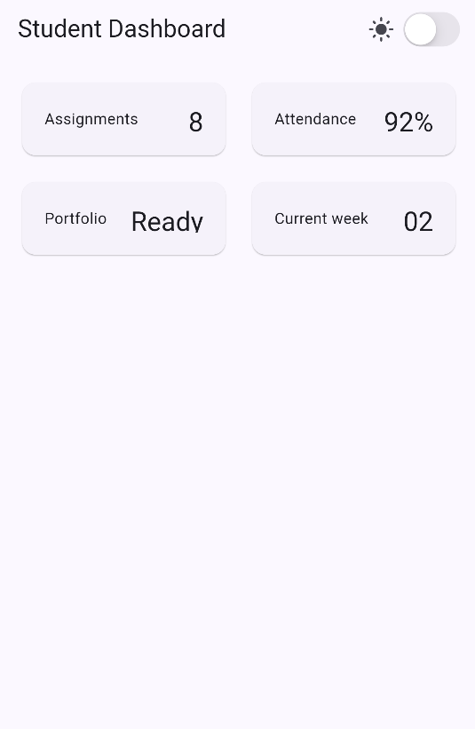
2. i changed the color theme like this 
"themeMode: isDark ? ThemeMode.dark : ThemeMode.system,"
so even though i change the mode in the apps, it still dark because my system is dark mode.
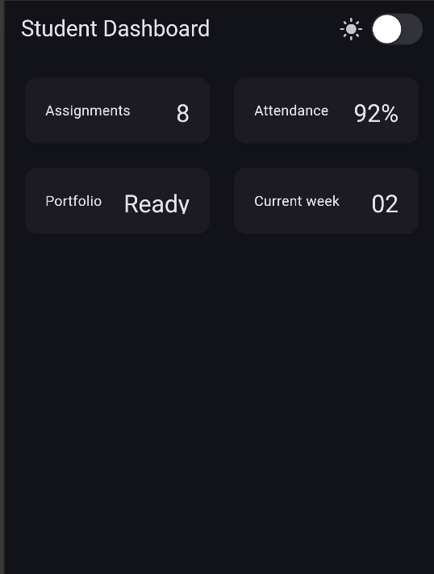
3. Iphone 14 Pro Max 
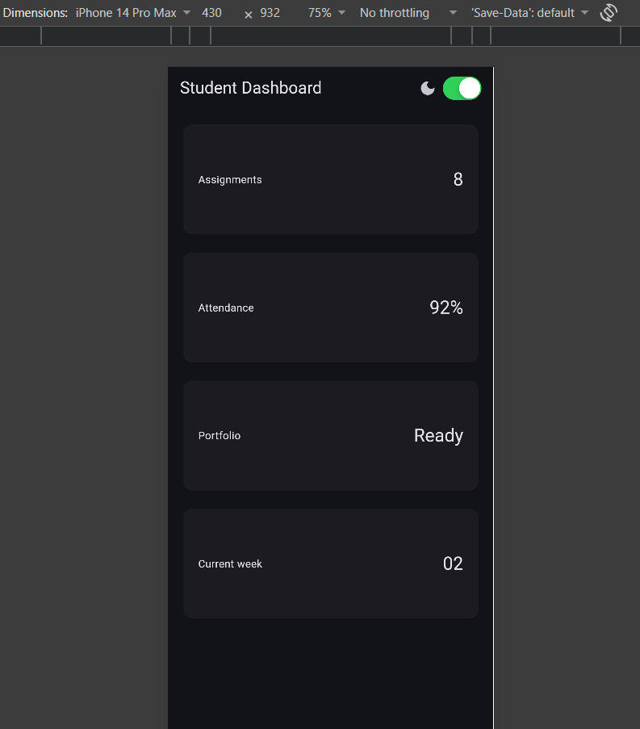
iPad pro
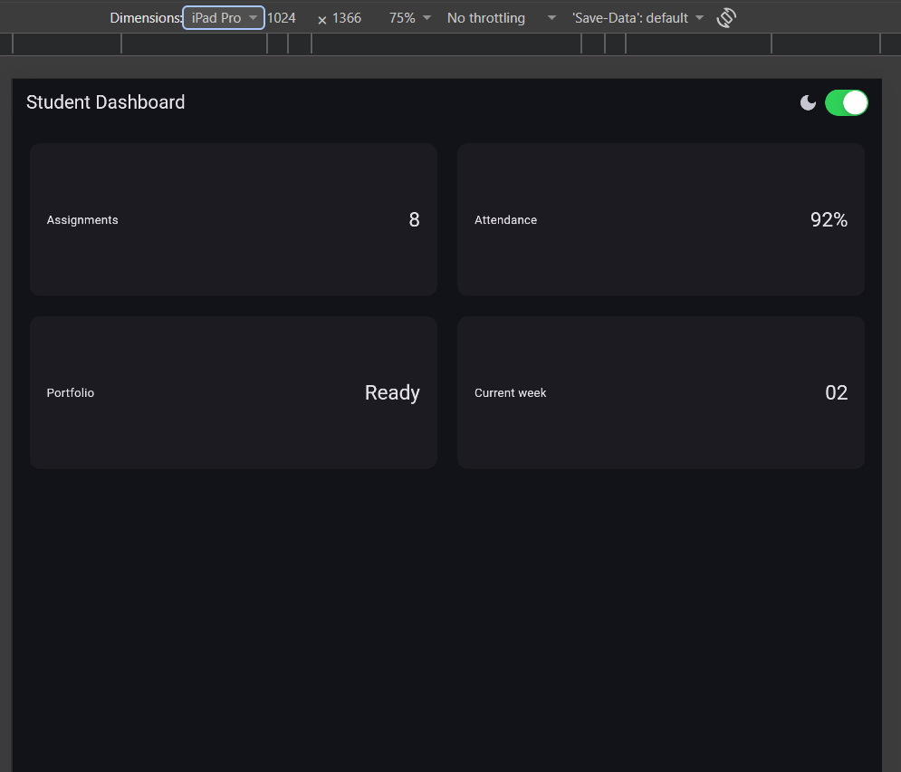
4. 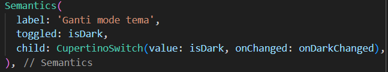
to give context about the button.
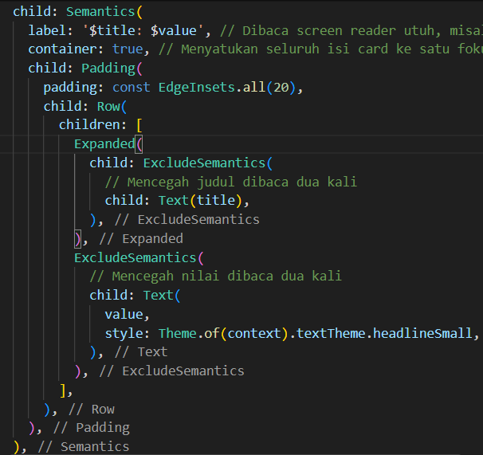
to combine separate data to a complete content

6. ASSIGNMENT and AI design exploration
