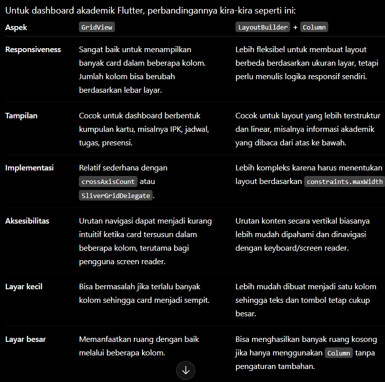
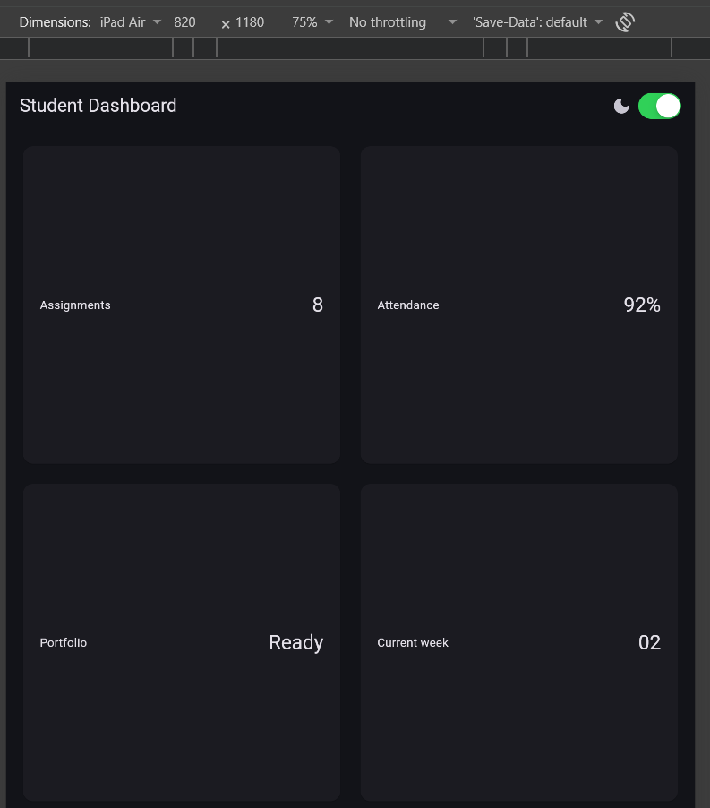
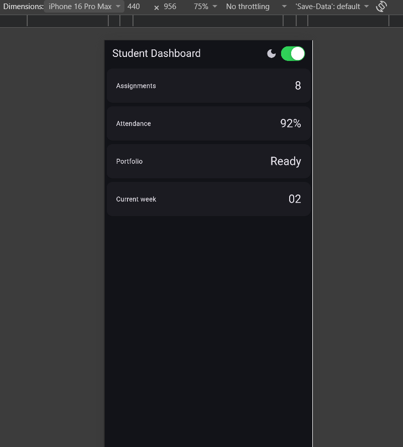
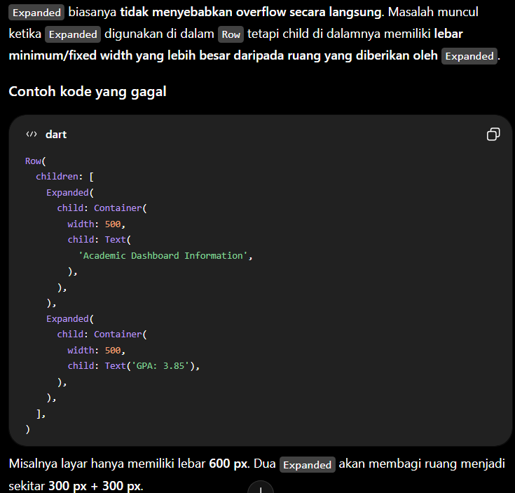
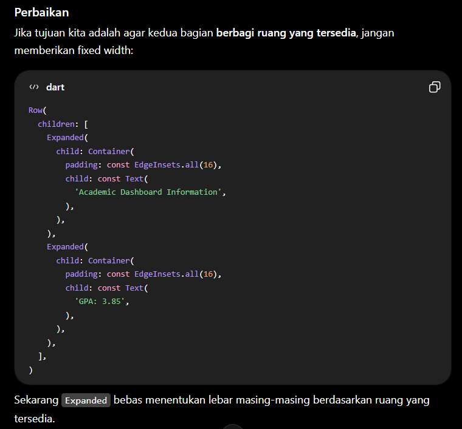
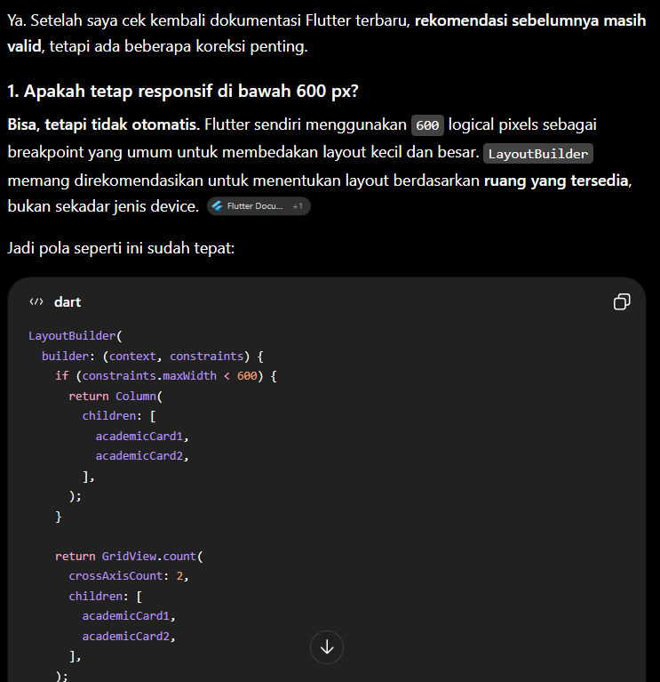
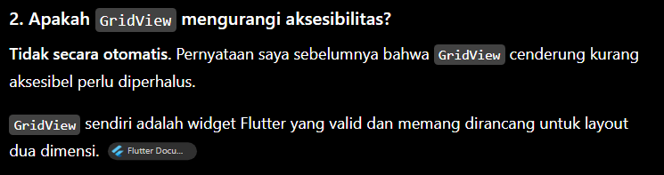
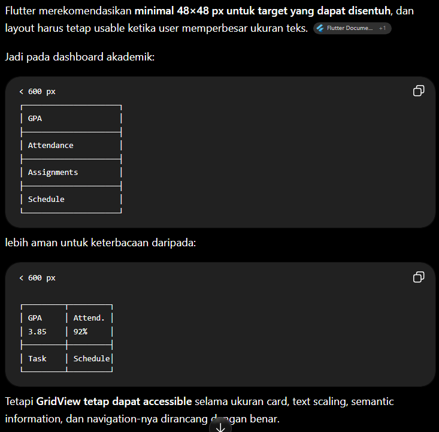
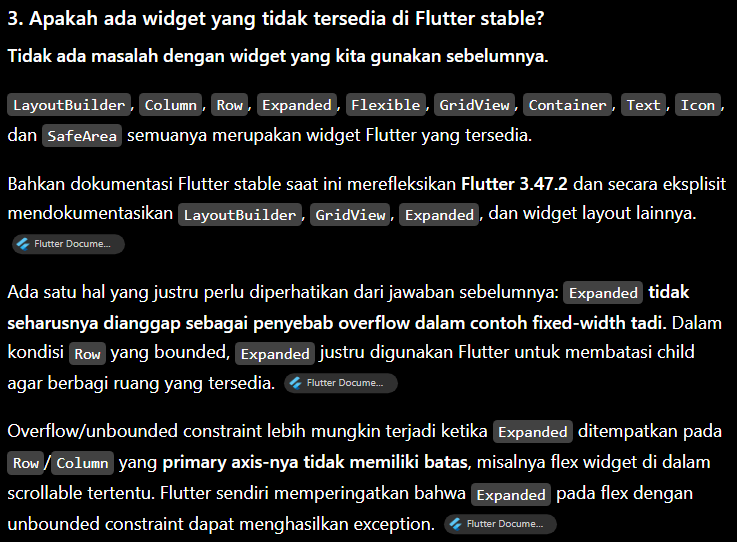
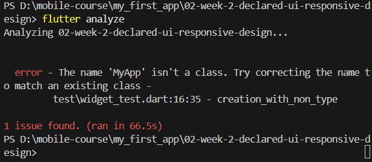

4. PRAKTIKUM: Layout Sederhana (warm-up)

Experiment Warm-Up
1. 
2. 
3. 

5. PRAKTIKUM: Dashboard Responsif

Experiment Layout
1. When i change it to 300 it will look like this

2. i changed the color theme like this 
"themeMode: isDark ? ThemeMode.dark : ThemeMode.system,"
so even though i change the mode in the apps, it still dark because my system is dark mode.

3. Iphone 14 Pro Max 

iPad pro

4. 
to give context about the button.

to combine separate data to a complete content

6. ASSIGNMENT and AI design exploration

AI Prompt Challenge
1. Prompt: "Bandingkan dua tata letak dashboard akademik untuk Flutter: versi GridView dan versi LayoutBuilder + Column. Jelaskan trade-off responsif dan aksesibilitasnya."
Answer:

Test: GridView

LayoutBuilder + Column

2. Prompt: "Jelaskan kapan penggunaan Expanded justru menyebabkan overflow di dalam Row, beri contoh kode yang gagal dan perbaikannya."
Answer: 

3. Prompt: "Periksa kembali rekomendasi layout di atas: apakah tetap responsif di bawah 600px, apakah mengurangi aksesibilitas, dan apakah ada widget yang tidak tersedia di Flutter stabil saat ini?"
Answer:

Refactoring Challenge
1. class InfoCard extends StatelessWidget {
  const InfoCard({required this.title, required this.value, super.key});
  final String title;
  final String value;}
  InfoCard(title: 'Assignments', value: '8'),
              InfoCard(title: 'Attendance', value: '92%'), 
              InfoCard(title: 'Portfolio', value: 'Ready'), 
              InfoCard(title: 'Current week', value: '02'), 
2. style: Theme.of(context).textTheme.headlineSmall,
3. const double kWideBreakpoint = 700;
final columns = constraints.maxWidth >= kWideBreakpoint ? 2 : 1; 
4. 

Testing Dasar
flutter test

Reflection
1. Imperative UI explains how to build or change the UI step by step. Declarative UI explains what the UI should look like based on its current state.
2. Expanded helps widgets use the available space in a Row or Column. It can cause errors when there is not enough or unlimited space available.
3. Breakpoints make the UI fit different screen sizes. Themes make the UI consistent and can support light and dark modes.
4. I tested the code to make sure it worked, compiled correctly, and the layout was responsive.