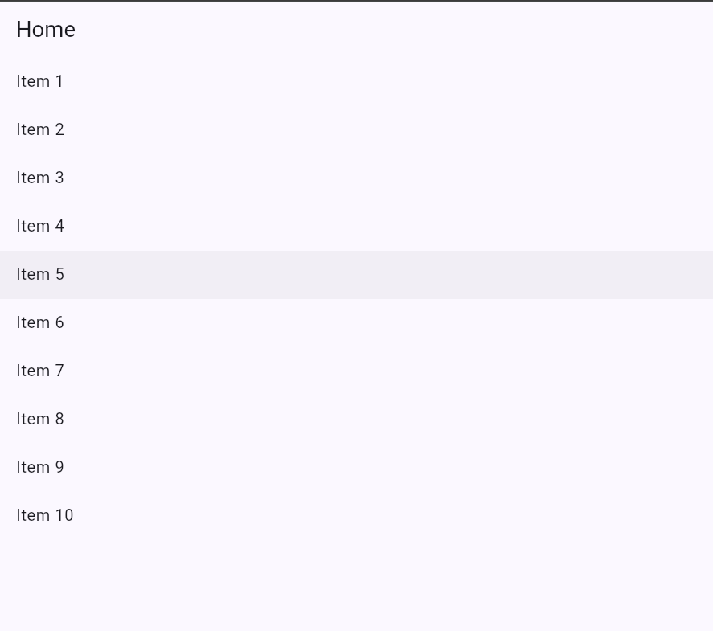
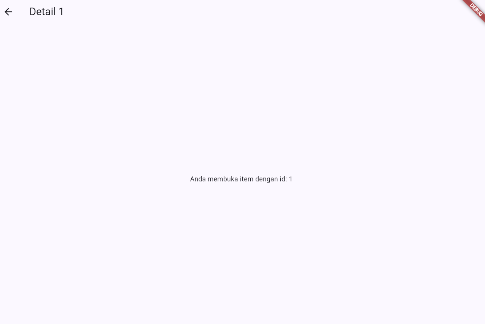
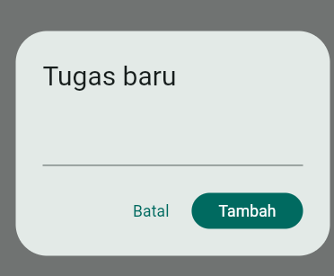
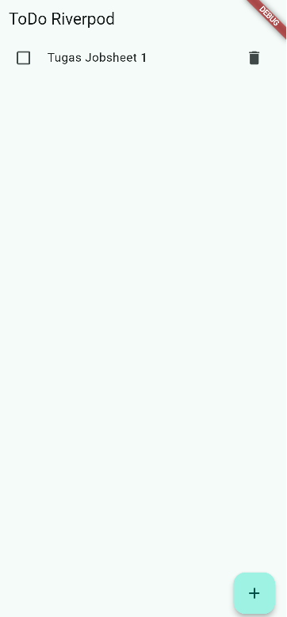
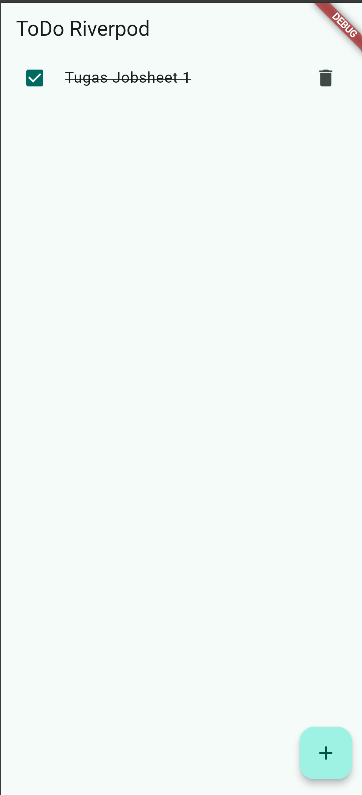
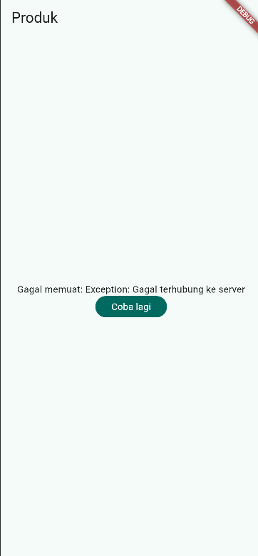
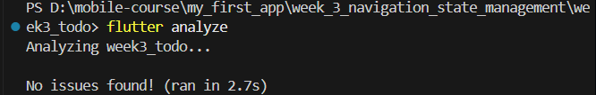
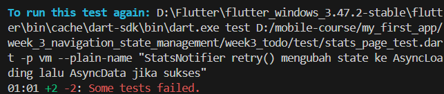
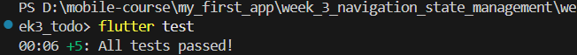
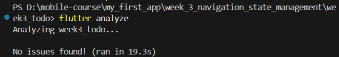

# week_3_navigation_state_management

Praktikum 1

Praktikum 2

Praktikum 3
1. Loading Page

2. Test the ERROR state

3. Press "Coba lagi" after we restore the code

4. Stale data is better than an empty screen because users can still see the previous data while new data is being loaded. This is useful when refreshing data from an API takes some time.

AI Assignment

* Pass, State is only ever replaced wholesale via state = const AsyncLoading() and state = await AsyncValue.guard(...). No .add() or in-place list mutation found. fetchStats() always returns a fresh list literal.
* Pass, ref.watch(statsProvider) is used inside StatsPage.build(). ref.read(statsProvider.notifier).retry() is used inside the onPressed callback. No ref.watch calls found inside callbacks.
* Pass, .when(loading:, error:, data:) — each branch renders distinct UI (spinner, error message + retry button, 3-item ListView). Not just a stubbed success path.
* Pass, Declared as AsyncNotifierProvider<StatsNotifier, List<StatItem>> — explicit generic types. Only one provider declaration exists in the file.
* Pass, Uses AsyncNotifier + AsyncNotifierProvider (modern pattern). No StateNotifier/StateNotifierProvider/StateProvider. No nested Consumer widgets — uses ConsumerWidget directly.
* Flutter Analyze

flutter test

Refactoring and testing

Flutter test

Flutter Analyze

