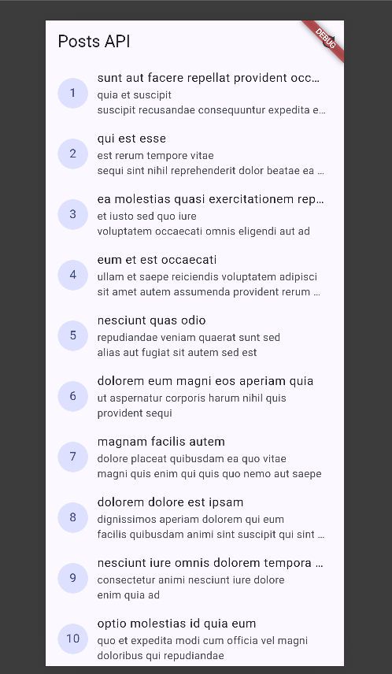
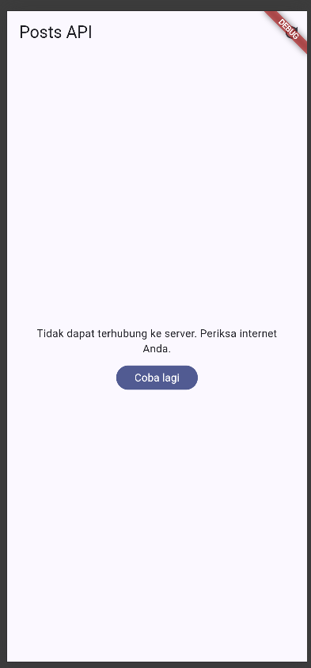
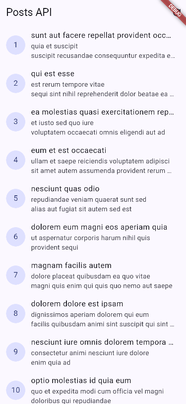
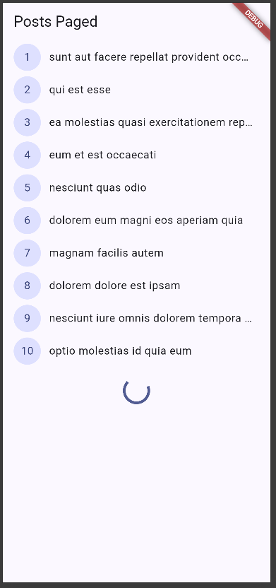
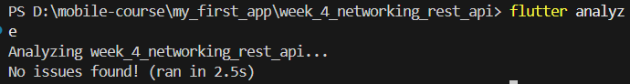
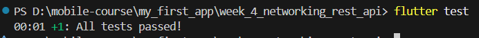
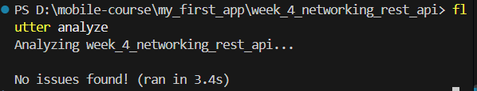
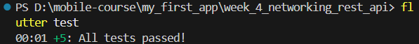
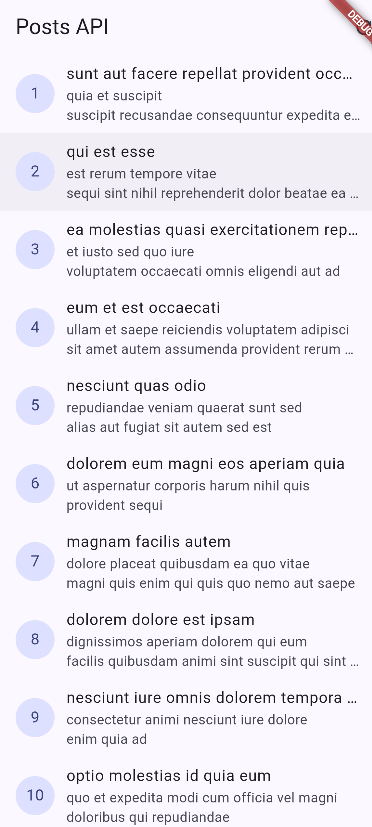
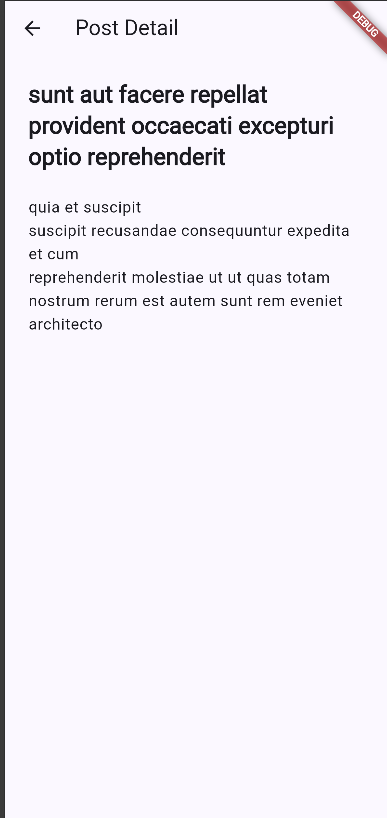

Practicum 2 

Uji tiga scenario error
1. 
2. 
3. 

AI Challenge
1. Does the UI call Dio directly?

The UI does not call Dio directly, The UI calls commentProvider, which use commentNotifier, then commentRepository to access the API through Dio.

2. is fromJson null-safe?

Comment.fromJson() uses nullable casts and fallback values(??) for postId, Id, name, email, and body, Therefore, missing or null fields will not cause crash.

3. Are Dio exceptions mapped to user-friendly messages?

Timeout errors (connectionTimeout, sendTimeout, receiveTimeout), connectionError, and badResponse are handled. HTTP 404 and 500 also have specific user-friendly messages.

4. Are baseUrl and timeout centralized?

The baseUrl, connectTimeout, sendTimeout, and receiveTimeout are configured in the shared Dio client through dioProvider. They are not repeated in each repository method.

5. Does the test check missing fields?

The unit test specifically provides JSON with missing fields and verifies that the model uses safe default values.

6. Was an additional edge case tested?

An additional edge case was tested by providing only the email field and verifying that the other missing fields receive their default values.

- flutter analyze

- flutter test

REFACTORING
- flutter analyze

- flutter test

